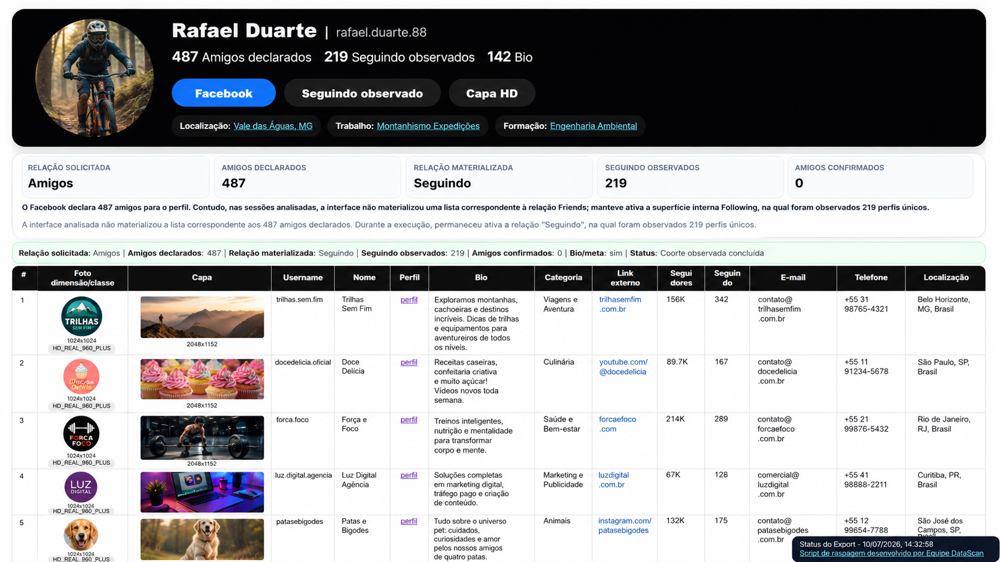
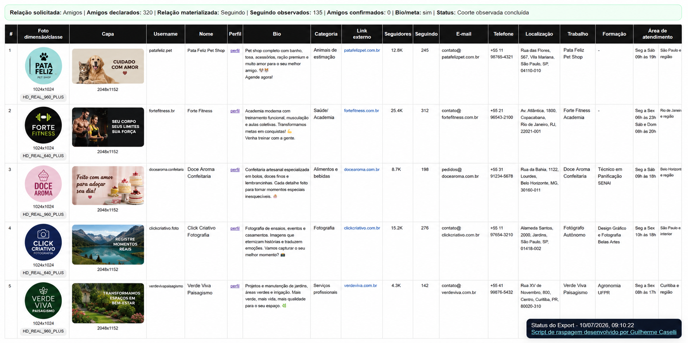
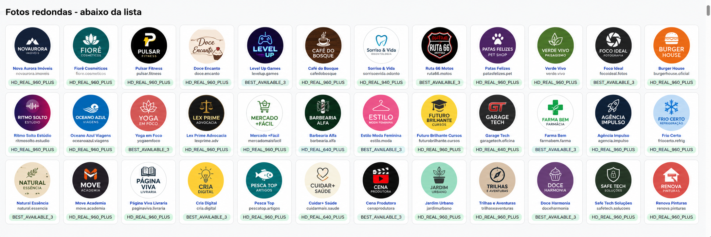

<h1 align="center">Raspador de Dados de Amigos do Facebook</h1>

  
  
  
  
  

---

# 🔎 RASPADOR DE DADOS DE AMIGOS DO FACEBOOK

Ferramenta baseada em extensão para navegador desenvolvida para coleta estruturada de dados relacionais disponíveis em perfis do Facebook, voltada à investigação digital, inteligência e OSINT.

A aplicação permite extrair dados de relações visíveis ou materializadas pela interface do Facebook, incluindo listas de amigos, seguidores ou perfis seguidos, conforme a superfície disponibilizada pelo próprio Facebook no momento da execução.

O sistema atua diretamente no ambiente do navegador, realizando leitura do DOM da página, acompanhamento da rolagem, identificação de perfis exibidos, enriquecimento de metadados e geração de arquivos estruturados para análise.

A ferramenta foi projetada para trabalhar com dados observáveis na interface, preservando a distinção entre relações declaradas pelo Facebook e relações efetivamente materializadas durante a navegação.

---

# 🖼️ DEMONSTRAÇÃO VISUAL

> **Dados demonstrativos:** as imagens abaixo foram preparadas com identidades, nomes, contatos, números e perfis fictícios. Elas servem exclusivamente para demonstrar a apresentação da ferramenta e não correspondem a uma coleta real.

## Visão geral do relatório

A visão geral apresenta o perfil-alvo, a relação solicitada, a relação efetivamente materializada pela interface, os totais observados e o início da grade estruturada de resultados.

  

## Dados estruturados e metadados

A grade organiza fotos, capas, nomes, perfis, bios, categorias, links externos, contadores públicos, contatos, localização e demais metadados disponíveis.

  

## Galeria visual dos perfis coletados

Ao final do relatório, a galeria facilita a conferência visual das fotos recuperadas e da classe de qualidade atribuída a cada mídia.

  

---

# ⚙️ FASE 1 — PREPARAÇÃO DO AMBIENTE

Antes de utilizar a ferramenta, é necessário possuir:

- 🟢 Navegador Google Chrome ou outro navegador baseado em Chromium
- 🟢 Acesso à plataforma Facebook
- 🟢 Conta autenticada no Facebook
- 🟢 Permissão para instalar extensões em modo desenvolvedor
- 🟢 Perfil ou página do Facebook com aba relacional acessível

---

# 🔍 FASE 2 — VERIFICAÇÃO DO AMBIENTE

Certifique-se de que:

- ✔ O Google Chrome está atualizado
- ✔ O Facebook carrega normalmente
- ✔ A conta está autenticada
- ✔ O modo desenvolvedor está habilitado no navegador
- ✔ O perfil analisado possui aba relacional acessível, como:
  - Amigos
  - Seguidores
  - Seguindo

---

# 📥 FASE 3 — DOWNLOAD DA FERRAMENTA

Existem duas formas distintas para realizar o download da ferramenta:

1. 📦 Download direto pela página do projeto no GitHub, sem necessidade de instalar o Git.
2. 🖥️ Download via Git, executando comandos no Prompt de Comando, PowerShell ou Terminal.

A seguir, serão descritas detalhadamente ambas as possibilidades.

---

## 📦 OPÇÃO 1 — DOWNLOAD DIRETO PELA PÁGINA DO PROJETO

Também é possível baixar a ferramenta diretamente pelo GitHub, sem utilizar o Git.

### 🌐 Passo a passo

1. Acesse o repositório:

    https://github.com/manualdeinvestigacaodigital/raspador-dados-amigos-facebook

2. Clique no botão verde **`<> Code`**.

3. Selecione a opção **`Download ZIP`**.

4. Aguarde o download do arquivo compactado.

5. Extraia o conteúdo do arquivo ZIP em uma pasta de sua preferência.

Após a extração, a estrutura esperada será semelhante a:

    raspador-dados-amigos-facebook/
    ├── EXTENSAO/
    │   ├── manifest.json
    │   ├── content.js
    │   ├── main_world_hook.js
    │   └── service_worker.js
    ├── docs/
    │   └── images/
    │       ├── 01-visao-geral-relatorio-facebook.png
    │       ├── 02-tabela-dados-perfis-facebook.png
    │       └── 03-galeria-perfis-facebook.png
    ├── README.md
    └── .gitignore

---

## 🖥️ OPÇÃO 2 — DOWNLOAD VIA GIT

O Git é uma ferramenta amplamente utilizada para baixar e atualizar projetos hospedados no GitHub.

### 🔎 VERIFICAR SE O GIT ESTÁ INSTALADO

Abra o Prompt de Comando, PowerShell ou Terminal e execute o seguinte comando:

    git --version

### ✅ Resultado esperado

Se o Git estiver instalado corretamente, será exibida uma mensagem semelhante a:

    git version 2.49.0.windows.1

### ❌ Caso o Git não esteja instalado

Se aparecer mensagem informando que o comando `git` não é reconhecido, será necessário instalar o Git.

### 🛠️ INSTALAÇÃO DO GIT NO WINDOWS

#### 🌐 1. Acesse o site oficial do Git

    https://git-scm.com/download/win

#### 📥 2. Baixe o instalador

O download normalmente inicia automaticamente.

#### ▶️ 3. Execute o instalador

Clique duas vezes no arquivo baixado.

#### ⚙️ 4. Instalação recomendada

Durante a instalação:

- ✔ Mantenha as opções padrão
- ✔ Clique em **Next** em todas as etapas
- ✔ Ao final, clique em **Install**
- ✔ Depois, clique em **Finish**

#### 🔄 5. Reinicie o terminal

Feche e abra novamente o Prompt de Comando ou PowerShell.

#### 🔎 6. Teste novamente

    git --version

Se a versão for exibida, o Git foi instalado com sucesso.

### 🚀 CLONAR O REPOSITÓRIO

Após confirmar que o Git está instalado, execute:

    git clone https://github.com/manualdeinvestigacaodigital/raspador-dados-amigos-facebook.git

O projeto será baixado para uma pasta chamada:

    raspador-dados-amigos-facebook

---

# 🔧 FASE 4 — INSTALAÇÃO DA EXTENSÃO NO GOOGLE CHROME

Nesta fase, a pasta da ferramenta será carregada no Google Chrome como uma extensão em modo desenvolvedor.

## 🌐 1. ABRIR A PÁGINA DE EXTENSÕES DO CHROME

Abra o Google Chrome e acesse o seguinte endereço:

    chrome://extensions/

## 🛠️ 2. ATIVAR O MODO DESENVOLVEDOR

Após acessar a página de extensões do Chrome, observe o canto superior direito da tela.

Nesse local, haverá um botão escrito **Modo do desenvolvedor**.

- Caso o botão já esteja habilitado, prossiga para a próxima etapa.
- Caso o botão esteja desabilitado, clique sobre ele ou arraste-o para a direita para habilitar o **Modo do desenvolvedor**.

Quando habilitado, o Chrome passará a exibir opções adicionais para carregamento manual de extensões.

## 📂 3. CARREGAR A EXTENSÃO SEM COMPACTAÇÃO

Com o **Modo do desenvolvedor** habilitado, clique no botão:

- 👉 **Carregar sem compactação**

Em seguida, selecione a pasta:

    EXTENSAO

Ou, no Windows, selecione o caminho equivalente:

    D:\Programação\Roseta\novo\Raspador de dados de amigos do Facebook\EXTENSAO

⚠️ Atenção:

Não selecione a pasta principal do projeto.

A pasta correta para carregar no Chrome é sempre:

    EXTENSAO

Essa pasta contém o arquivo:

    manifest.json

Após selecionar a pasta correta:

- ✔ A extensão será carregada automaticamente no navegador.
- ✔ O nome exibido será: **Raspador de dados de amigos do Facebook**.

---

# 🌐 FASE 5 — EXECUÇÃO DA FERRAMENTA

A ferramenta deve ser utilizada em páginas relacionais do Facebook.

### 📄 Acesse um perfil ou página do Facebook em uma das superfícies abaixo:

    https://www.facebook.com/usuario/friends
    https://www.facebook.com/usuario/followers
    https://www.facebook.com/usuario/following

Também pode haver variações de interface em que o Facebook exibe a relação dentro da aba de seguidores, com subtabs como:

    Followers
    Following

### ▶️ Em seguida:

- Abra a página relacional desejada.
- Aguarde os primeiros perfis aparecerem na tela.
- O painel da extensão será exibido no canto da página.
- Clique em **Raspar** ou no botão equivalente exibido pela extensão.

Conforme a relação detectada, o botão poderá indicar:

- **Raspar amigos**
- **Raspar seguidores**
- **Raspar seguindo**

---

# 🚀 FASE 6 — FUNCIONAMENTO DA FERRAMENTA

A ferramenta atua diretamente na página do Facebook, coletando dados em tempo real.

## 📡 COLETA DE DADOS

A aplicação realiza:

- 🔍 Leitura do DOM da página
- 📜 Rolagem assistida da superfície relacional
- 👤 Identificação de perfis exibidos
- 🔗 Captura de URLs dos perfis
- 🖼️ Captura de foto de perfil, quando disponível
- 🖼️ Captura de capa, quando disponível
- 🧩 Enfileiramento de perfis para enriquecimento
- 📊 Atualização de progresso no painel

## 🔎 RELAÇÕES SUPORTADAS

A ferramenta pode atuar sobre superfícies relacionais como:

- 👥 Amigos
- 👤 Seguidores
- ➡️ Seguindo

A relação efetivamente coletada depende da interface apresentada pelo Facebook no momento da execução.

Quando houver divergência entre a relação declarada pelo Facebook e a lista efetivamente materializada na interface, a ferramenta deve preservar essa distinção no relatório.

Exemplo:

    O Facebook pode declarar determinado número de amigos, mas a interface analisada pode materializar somente uma subcoleção visível, como "Seguindo" ou "Seguidores".

Nesses casos, a ferramenta não deve reclassificar a relação de forma artificial.

---

# 📊 FASE 7 — DADOS EXTRAÍDOS

A ferramenta identifica e estrutura, quando disponíveis, os seguintes campos:

- 📌 Número sequencial
- 🖼️ Foto do perfil
- 🖼️ Foto de capa
- 👤 Username
- 🧾 Nome exibido
- 🔗 Link do perfil
- 📝 Bio
- 🏷️ Categoria
- 🌐 Link externo
- 👥 Seguidores
- ➡️ Seguindo
- 📧 E-mail
- ☎️ Telefone
- 📍 Localização
- 💼 Trabalho
- 🎓 Formação
- 🕒 Horário
- 📌 Área de atendimento
- 🧩 Informações complementares, quando houver

---

# 🧠 FASE 8 — ENRIQUECIMENTO DOS DADOS

Após identificar os perfis visíveis, a ferramenta pode realizar enriquecimento progressivo das informações.

## 🔍 BIO E METADADOS

O enriquecimento pode buscar:

- Bio do perfil
- Categoria
- Links externos
- Contadores públicos
- Informações de contato
- Localização
- Trabalho
- Formação
- Horário de atendimento
- Área de atendimento

## 🖼️ IMAGENS

A ferramenta tenta recuperar:

- Foto de perfil
- Foto em melhor qualidade disponível
- Foto de capa, quando materializada
- Links diretos para abertura da imagem

No Excel, as imagens podem ser representadas por hiperlinks, evitando aumento excessivo do tamanho das células e problemas de compatibilidade do arquivo XLSX.

---

# 📁 FASE 9 — GERAÇÃO DE SAÍDAS

A ferramenta permite gerar arquivos estruturados para análise e documentação.

As saídas podem incluir:

- 📄 HTML estruturado
- 🧾 JSON técnico
- 📑 CSV bruto
- 📊 Excel XLSX organizado
- 🖨️ PDF ou impressão nativa, quando disponível

---

# 📊 FASE 10 — EXPORTAÇÃO EM EXCEL XLSX

A exportação em Excel foi projetada para facilitar análise em planilha.

O arquivo XLSX pode conter:

- Cabeçalho congelado
- Filtros
- Colunas ajustadas
- Aba de dados
- Aba de resumo
- Hiperlinks clicáveis para:
  - Foto
  - Capa
  - Perfil
  - Link externo
  - E-mail

O Excel não precisa embutir as imagens diretamente nas células. A ferramenta prioriza hyperlinks para preservar:

- ✔ Leveza do arquivo
- ✔ Compatibilidade
- ✔ Organização da planilha
- ✔ Tamanho adequado das células

---

# 🔐 FASE 11 — INTEGRIDADE DOS DADOS

A ferramenta pode registrar informações úteis para rastreabilidade da coleta, como:

- URL analisada
- Data e horário da execução
- Relação detectada
- Quantidade declarada pela interface
- Quantidade efetivamente observada
- Quantidade enriquecida
- Fontes utilizadas para os dados coletados

Esses elementos auxiliam na análise posterior e na verificação da consistência do resultado.

---

# 🔄 FASE 12 — FLUXO OPERACIONAL

1. 📥 Baixar a ferramenta
2. 🔧 Instalar a extensão no Chrome
3. 🌐 Abrir o Facebook autenticado
4. 👤 Acessar o perfil ou página desejada
5. 📄 Abrir uma aba relacional, como Amigos, Seguidores ou Seguindo
6. ▶️ Executar o raspador
7. 📜 Aguardar a rolagem e coleta dos perfis observáveis
8. 🧠 Aguardar o enriquecimento progressivo dos metadados
9. 📁 Exportar em HTML, JSON, CSV ou XLSX
10. 📊 Analisar os dados estruturados

---

# ⚠️ FASE 13 — LIMITAÇÕES

[Não verificado] O funcionamento pode variar conforme alterações internas do Facebook, incluindo:

- Mudanças no DOM
- Alterações na interface
- Restrições de acesso
- Diferenças entre perfis pessoais, páginas e perfis profissionais
- Limitações de visibilidade impostas pela própria plataforma
- Divergência entre números declarados e listas efetivamente materializadas
- Carregamento parcial de relações em razão da interface dinâmica

A ferramenta não deve presumir que todos os números declarados pela plataforma foram efetivamente materializados no DOM.

Quando a interface não exibir a totalidade da lista, a ferramenta deve reportar apenas os perfis efetivamente observados.

---

# ⚠️ FASE 14 — SEGURANÇA E USO RESPONSÁVEL

Evite:

- ❌ Executar em contas sensíveis sem avaliação prévia
- ❌ Compartilhar dados sem validação
- ❌ Utilizar fora de contexto legal
- ❌ Reclassificar artificialmente relações não materializadas
- ❌ Atribuir à ferramenta dados que não foram observados

A ferramenta deve ser utilizada de forma responsável, respeitando a legislação aplicável, os limites da investigação e o contexto autorizado de uso.

---

# 📚 FASE 15 — REFERÊNCIA TÉCNICA E AUTORIA

Este projeto integra um conjunto mais amplo de ferramentas voltadas à investigação digital, inteligência e OSINT.

O autor deste projeto é também autor da obra:

📖 **Manual de Investigação Digital — Editora Juspodivm**

    https://www.editorajuspodivm.com.br/manual-de-investigacao-digital-2026-caselli

A obra reúne fundamentos teóricos e aplicações práticas voltadas à investigação digital contemporânea.

---

# 🧠 FASE 16 — INTEGRAÇÃO COM A OBRA

Este repositório representa uma aplicação prática das técnicas abordadas no livro, permitindo:

- ✔ Aplicação de conceitos de OSINT
- ✔ Estruturação de coleta de dados relacionais
- ✔ Organização de dados públicos observáveis
- ✔ Apoio à análise investigativa
- ✔ Preservação de registros estruturados para estudo e documentação

---

# 👤 AUTOR

**Guilherme Caselli**  
Delegado de Polícia  
Autor do livro **Manual de Investigação Digital**

    https://instagram.com/guilhermecaselli

    https://www.editorajuspodivm.com.br/manual-de-investigacao-digital-2026-caselli

---

# 🎯 FINALIDADE

- 🕵️ Investigação digital
- 🧠 Inteligência
- 🌐 OSINT
- 📊 Análise de dados públicos observáveis
- 📁 Coleta estruturada de informações relacionais
- 🧾 Organização de evidência digital
